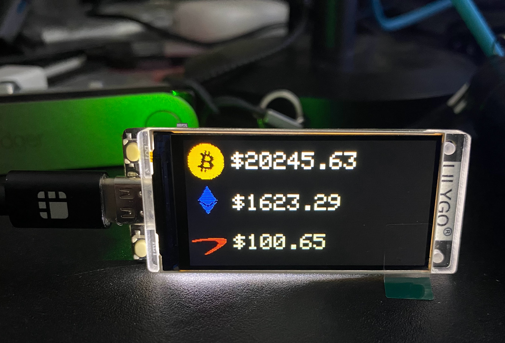
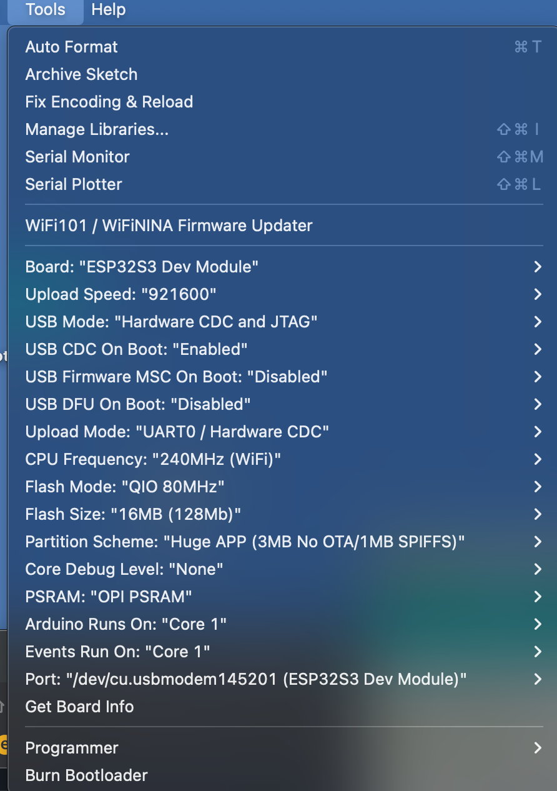

# AssetTicker
Crypto and Stock Asset ticker based on Lilygo T-Display-S3

This started as an attempt to port over and improve the Cryptoticker from the TTGO-T4 example code. The original used an API from CoinMarketCap that has since been deprecated, and the new one (I did find a fork for that) is more and more limited as they are limiting the functionality of the API.

The Coincap API is free, reasonable limits, and while it doesn't have as many of the same up-down comparison metrics, I think it will do.

While not the same shape and size, the new Lilygo T-Display-S3 features a really sharp display with The new ESP-S3 processor which features more memory and several other interesting features. The problem is that this board is not very well documented, so I will attempt to also consolodate my learnings here.

Here is the pinout diagram that is provided:

## Arduino Settings

